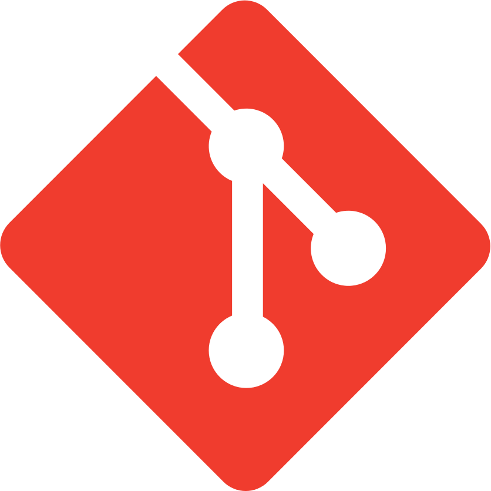
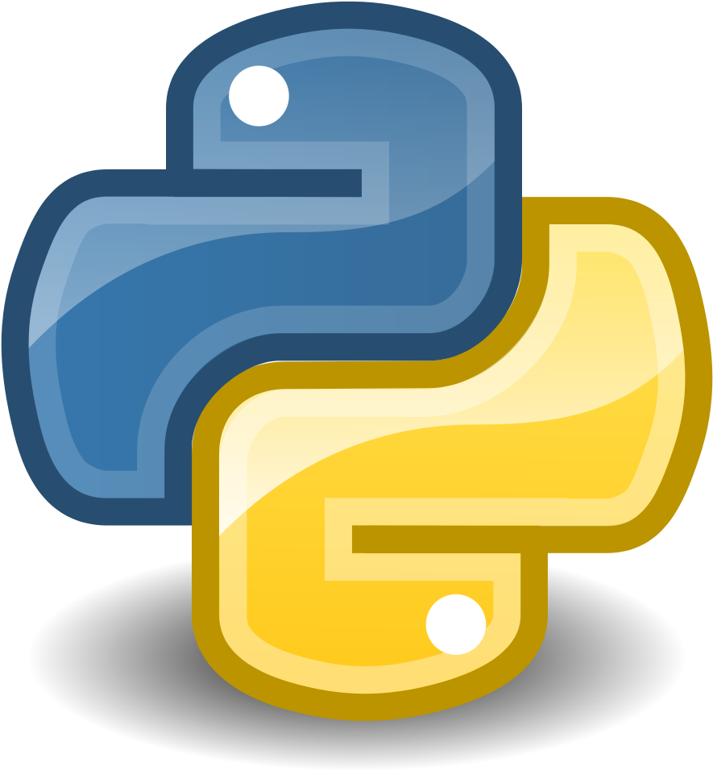
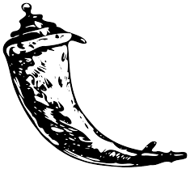
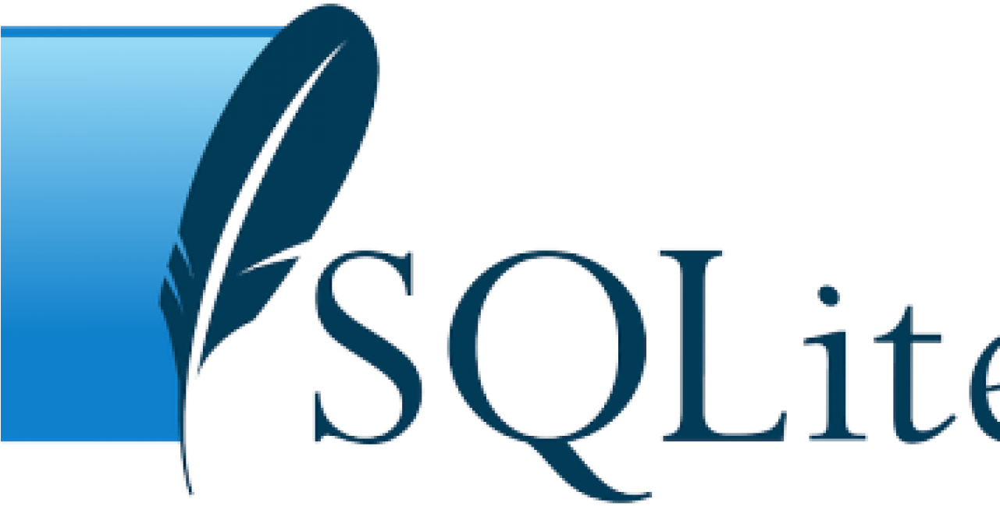
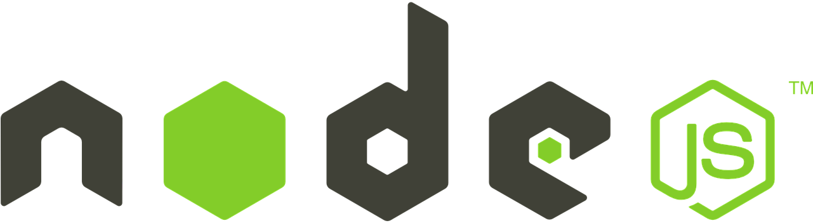

<!-- Adding icons -->
<link rel="stylesheet" href="https://use.fontawesome.com/releases/v5.6.1/css/all.css" integrity="sha384-gfdkjb5BdAXd+lj+gudLWI+BXq4IuLW5IT+brZEZsLFm++aCMlF1V92rMkPaX4PP" crossorigin="anonymous">

## Hi! Nice to meet you! :wave:

### About me :woman_technologist:

I am **Paloma Vinaches**, a Spanish :es: **web developer** based in Luxembourg :luxembourg:

    I have been studying programming for the last two years. I started with Python and Matlab for work reasons. Still, after finishing <a href="https://cs50.harvard.edu/x/2020/">CS50x</a> in October 2020, I decided to become a web developer. Since 2021, I am studying and practising full time.

### Languages and Tools :computer:

    <!-- Icons from https://www.pngitem.com/ -->
    
    
    
    
    
    
    
    
    

### What I am focusing on :mag:

* [CS50w](https://cs50.harvard.edu/web/2020/): submitted projects Network and Capstone.
* [Introduction to Networking](https://www.edx.org/course/introduction-to-networking): started July 21st 2021.
* [Discover platform](https://rocketseat.com.br/discover): revision, practice and nodejs
* [AWS Developer Series](https://www.edx.org/xseries/aws-developer-series?index=product&queryID=824783085d1f78285f594e180b37252c&position=1): first course on building

### Verification links to certificates and credentials :heavy_check_mark:
* [CS50 - edx Harvard](https://courses.edx.org/certificates/8ca55a994a1849e3b3df0535d1b9583e): issued October 2020
* [Composição de programas em Python - UFMG](https://moodle.dcc.ufmg.br/mod/simplecertificate/verify.php?code=5f1d823c-b160-4a9d-b911-3290ac160002): issued July 2020
* [Matlab - coursera Vanderbilt university](https://coursera.org/account/accomplishments/verify/QMD76GCUJULA): issued March 2020

### Contact information and project videos :email:

    You can find me on <i class="fab fa-linkedin"></i> <a href="http://www.linkedin.com/in/paloma-vinaches-melguizo/">LinkedIn</a> and see my CS50 and CS50w project videos on my <i class="fab fa-youtube"></i> <a href="https://www.youtube.com/channel/UCycE9wXnL8SiJQWJzCtRgTA">Youtube channel.</a>

### Github Stats :chart_with_upwards_trend:

